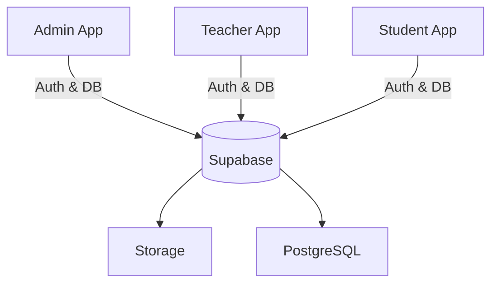

# SchoolManagementProject

# 🏫 Smart School Management System

A comprehensive, multi-role school management ecosystem built with **Flutter** and **Supabase**. This project provides dedicated applications for Admins, Teachers, and Students to streamline educational operations and communication.

---

## 🏗️ Architecture Overview

The project follows a **Multi-App Architecture** where role-specific logic is decoupled into separate Flutter projects. This ensures security, reduces app size for end-users, and allows for independent scaling of features.



### 📱 Project Components

| Role | Directory | Key Features |
| :--- | :--- | :--- |
| **Admin** | `admin/admin_app_school` | Master controls, User management, Fee tracking, Notices. |
| **Teacher**| `teachers_admin/teacher_admin`| Attendance marking, Homework assignment, Notices. |
| **Student**| `studensts/student_app` | Attendance view, Homework view, Fee status. |

---

## 🛠️ Tech Stack

- **Frontend:** [Flutter](https://flutter.dev/) (3.11.1+)
- **Backend:** [Supabase](https://supabase.com/) (Auth, PostgreSQL, Real-time)
- **State Management:** [Provider](https://pub.dev/packages/provider)
- **UI/UX Frameworks:**
  - `flutter_screenutil`: For responsive layouts.
  - `google_fonts`: Custom typography.
  - `fl_chart`: Data visualization and analytics.
  - `shimmer`: Loading state aesthetics.
  - `cached_network_image`: Image optimization.

---

## 🚀 Getting Started

### 1. Prerequisites
- Flutter SDK installed.
- Supabase account and project created.

### 2. Supabase Configuration
Each app requires the Supabase URL and Anon Key. Update the constants in:
- `admin/admin_app_school/lib/core/constants/app_constants.dart`
- `teachers_admin/teacher_admin/lib/core/constants/app_constants.dart`
- `studensts/student_app/lib/core/constants/app_constants.dart`

### 3. Setup Database & Accounts
Use the provided setup script to initialize default roles and accounts:
```bash
# From the root directory
dart recreate_accounts.dart
```
*Default Credentials:*
- **Admin:** `admin@school.com` | `Admin@123`
- **Teacher:** `teacher@school.com` | `Teacher@123`
- **Student:** `student@school.com` | `Student@123`

### 4. Running the Apps
Navigate to any app directory and run:
```bash
flutter pub get
flutter run
```

---

## 📊 Database Schema

The system uses a relational PostgreSQL schema hosted on Supabase:

- **`users`**: Central auth table storing role-based IDs.
- **`students`**: Detailed profiles linked to `users`.
- **`teachers`**: Teacher details and assigned subjects.
- **`attendance`**: Daily records with present/absent status.
- **`homework`**: Assignment details posted by teachers.
- **`fees`**: Transaction records and payment status.
- **`notices`**: Global and class-specific announcements.

---

## 📁 Key Folder Structure (Feature-First)

The apps follow a clean, feature-first organization:
```text
lib/
├── core/           # Constants, Themes, Utilities
├── features/       # Role-specific modules (Auth, Dashboard, etc.)
├── models/         # Data blueprints
├── providers/      # State management logic
├── services/       # Supabase API interaction
└── shared/         # Reusable widgets
```

---

## 💎 Design Aesthetics
- **Responsive:** Optimized for diverse mobile screen sizes.
- **Premium UI:** Uses modern gradients, smooth transitions, and custom icons.
- **Data Driven:** Real-time dashboards provide instant insights into school health.
